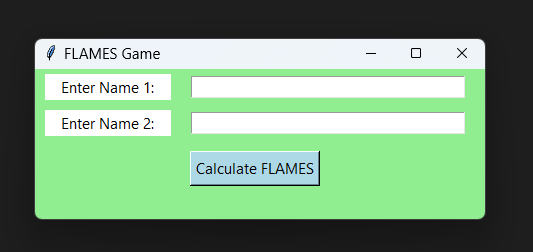

# FLAMES Game with GUI

This project is a fun application that calculates the relationship between two names using the FLAMES game logic. It features a graphical user interface (GUI) built with Python's `tkinter` library.

## How to Play
1. Run the program.
2. Enter two names in the input fields.
3. Click the "Calculate FLAMES" button to see the result, which will be one of the following: `Friends`, `Lovers`, `Affection`, `Marriage`, `Enemies`, or `Sibling`.

**Note:** This game is just for fun and entertainment purposes!

## Concepts Used
- **Python Programming**: The entire project is implemented in Python.
- **tkinter Library**: Used to create the graphical user interface (GUI).
- **messagebox Module**: Used to display the FLAMES result in a popup window.
- **Dictionary Comprehension**: Used to count character occurrences in the `flames_count` function.
- **Set Operations**: Used to find common characters between two names.
- **Modulus Operator**: Used to calculate the FLAMES result index.
- **Functions**: Modularized logic into reusable functions like `flames_count` and `flames_result`.

## How to Run
1. Make sure you have Python installed on your system.
2. Clone this repository or download the ZIP file.
3. Navigate to the project directory and run the following command in your terminal:
   ```bash
   python "Flames with GUI.py"
    ```

**Output:**<br>

